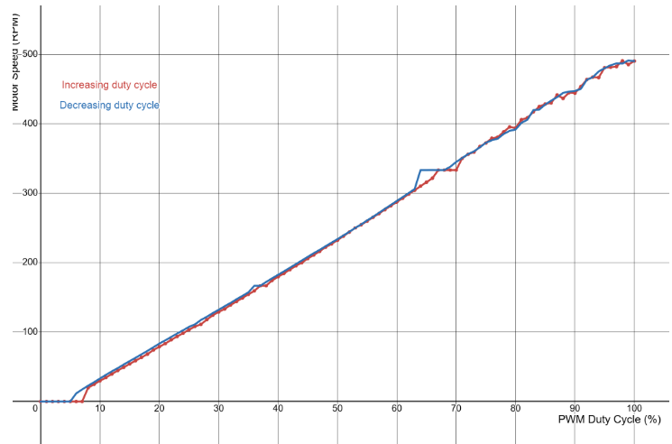
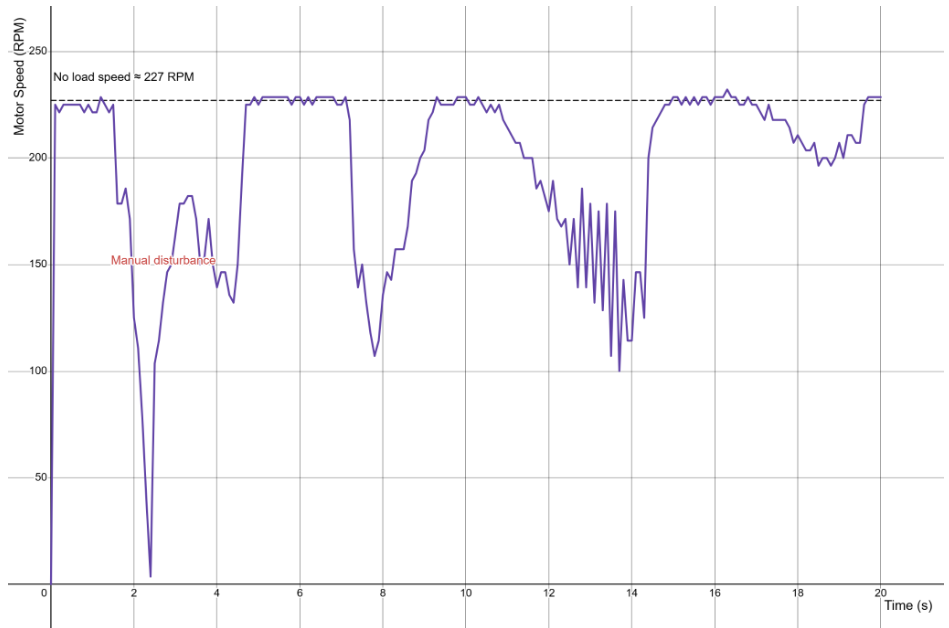
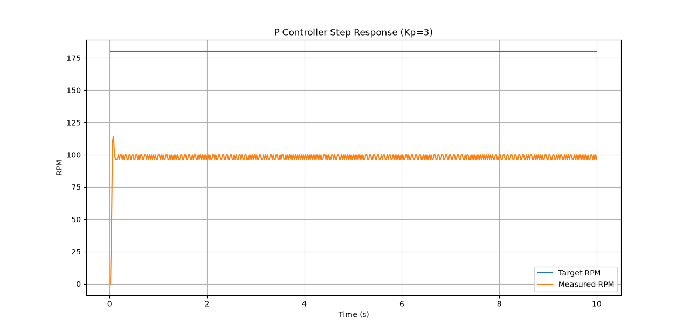
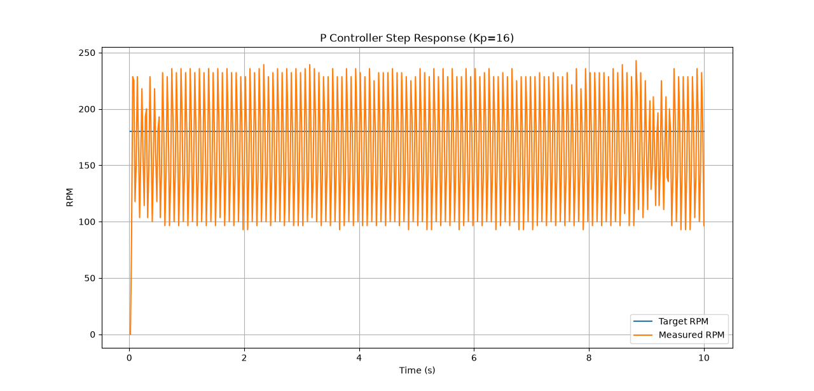
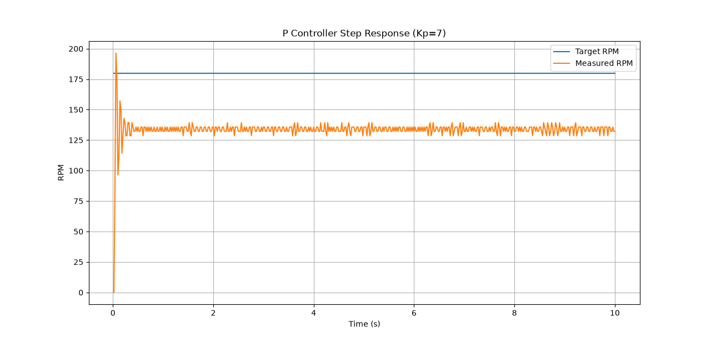
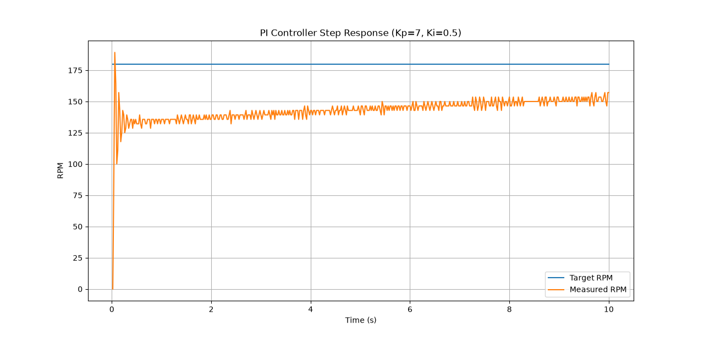
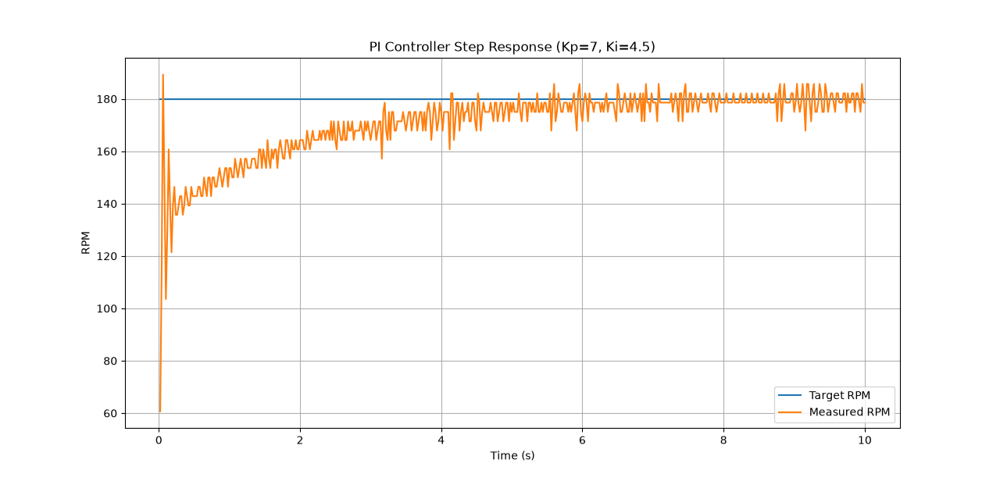
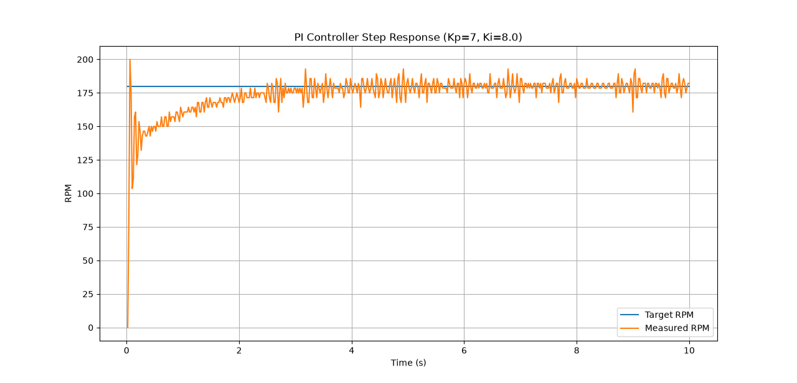

# STM32 Closed-Loop DC Motor Control

A bare-metal closed-loop DC motor speed controller built on the STM32G070 using quadrature encoder feedback and PI control.

This project is part of my larger STM32 bare-metal framework and my work toward developing the motion-control system for a Micromouse robot. The goal was not simply to make a motor spin, but to understand the complete control stack from timer peripherals to closed-loop velocity control.

The current implementation supports:

- PWM-based DC motor actuation
- Quadrature encoder feedback
- Real-time velocity measurement
- Proportional (P) control
- Proportional-Integral (PI) control
- Output saturation
- Integral anti-windup
- Non-blocking periodic controller updates
- UART telemetry and CSV logging
- Python-based controller analysis and visualization

> **Current status:** PI speed control is working and has been experimentally characterized on a no-load benchtop motor. The current gains are preliminary and are not intended to represent final Micromouse drivetrain tuning.

---

## Demo

<!-- TODO: Replace with GIF/video -->


**Target velocity: 180 RPM**

The controller continuously measures motor velocity using the quadrature encoder, compares it against the target velocity, and adjusts PWM duty cycle to reduce the error.

<!-- Optional second GIF:
Show motor running at 180 RPM, apply a temporary disturbance/load,
then show it recovering toward 180 RPM.
-->

---

## System Overview

The control system spans several layers of the STM32 firmware stack:

```text
                         Target RPM
                             │
                             ▼
                    ┌─────────────────┐
                    │ Motor Controller│
                    └────────┬────────┘
                             │
                             ▼
                       ┌──────────┐
                       │ PI / PID │
                       └────┬─────┘
                            │
                      PWM Command
                            │
                            ▼
                     ┌────────────┐
                     │  DC Motor  │
                     │   Driver   │
                     └─────┬──────┘
                           │
                           ▼
                     ┌───────────┐
                     │ TB6612FNG │
                     └─────┬─────┘
                           │
                           ▼
                      ┌─────────┐
                      │DC Motor │
                      └────┬────┘
                           │
                           ▼
                 ┌──────────────────┐
                 │Quadrature Encoder│
                 └────────┬─────────┘
                          │
                          └──────────────► Feedback
```

<!-- TODO: Replace ASCII diagram with system architecture diagram -->

The STM32 is responsible for both sides of the control loop:

1. **Actuation** — Timer PWM controls the motor through the TB6612FNG.
2. **Measurement** — Timer encoder mode decodes the motor's quadrature encoder.
3. **Control** — The motor controller compares measured velocity against the target and computes the next actuator command.

---

## Why Closed-Loop Control?

Initially, I characterized the motor using open-loop PWM control.

Two experiments were particularly useful.

### Experiment 1 — PWM vs RPM

The motor was swept from approximately 0% to 100% PWM and back down while measuring its steady-state RPM.

<!-- TODO: Insert PWM vs RPM graph -->



This showed that PWM duty cycle influences motor speed, but there is not a perfect linear relationship between PWM and RPM. The motor also exhibited a low-duty-cycle deadband where the supplied power was insufficient to reliably begin rotating.

### Experiment 2 — Constant PWM Under Disturbance

The motor was then held at a constant PWM command while an external load was manually applied.

<!-- TODO: Insert disturbance graph -->



Although PWM remained constant, motor speed changed significantly under load.

This demonstrated the central limitation of open-loop control:

> **A PWM command does not guarantee a particular motor velocity.**

If the objective is to command a velocity rather than simply command motor power, the system needs feedback.

---

## Encoder Feedback

Motor velocity is measured using a quadrature encoder connected to an STM32 timer configured in encoder mode.

The encoder produces two square waves approximately 90° out of phase:

<!-- TODO: Insert quadrature encoder waveform diagram -->

```text
Channel A: ────┐    ┌──────┐    ┌────
               └────┘      └────┘

Channel B: ───────┐    ┌──────┐
                  └────┘      └────
```

By observing the phase relationship and edges of both signals, the timer can determine both displacement and direction.

For the current motor and encoder configuration:

```text
210 pulses / revolution
× 4 quadrature decoding
-------------------------
840 counts / revolution
```

The firmware converts the change in encoder count over a known sampling interval into motor velocity.

---

## Sampling Period

One important discovery during development was that velocity measurement depends heavily on the sampling interval.

At 840 counts/revolution, measuring over an interval that is too short produces severe quantization.

For example, a single encoder count observed over 1 ms corresponds to:

```text
(1 / 840 rev) × (60 s/min) / (0.001 s)
≈ 71.43 RPM
```

This means a 1 ms measurement interval cannot provide fine velocity resolution at the speeds being tested.

Increasing the measurement/control interval to approximately 20 ms provided substantially more useful velocity feedback.

This was an important reminder that the control algorithm cannot be considered independently from the sensors and timing used to provide its measurements.

---

## Proportional Control

The first closed-loop controller implemented was a proportional controller:

```text
error = target - measurement

output = Kp × error
```

The controller output is interpreted as a PWM compare value and constrained to the valid actuator range.

Increasing `Kp` makes the controller react more aggressively to velocity error.

However, experimental testing demonstrated the expected tradeoff:

- Small `Kp` → larger steady-state error
- Larger `Kp` → smaller steady-state error
- Excessively large `Kp` → increased oscillation and reduced stability

<!-- TODO: Insert Steady-State Error vs Kp -->



<!-- TODO: Insert Oscillation vs Kp -->



A value of approximately:

```text
Kp = 7
```

was selected as a reasonable experimental starting point for further PI testing.

This value is specific to the current benchtop setup and should not be interpreted as a universal motor-controller gain.



---

## Why P Control Cannot Eliminate Steady-State Error

An important result of the proportional-control experiments was that the motor consistently settled below the target velocity.

This behavior is expected.

The motor requires a nonzero PWM command to maintain a nonzero velocity. However, for a pure proportional controller:

```text
output = Kp × error
```

If the error becomes zero:

```text
output = 0
```

The controller therefore needs some remaining error in order to generate the PWM required to sustain the motor's velocity.

This creates a nonzero steady-state error.

To remove this error, an integral term was added.

---

## PI Control

The PI controller adds accumulated error to the proportional controller:

```text
P = Kp × error

integral += error × dt
I = Ki × integral

output = P + I
```

The proportional term responds to the **current error**, while the integral term responds to the **accumulation of error over time**.

This allows the controller to retain the actuator command required to maintain the target velocity even as the proportional error approaches zero.

---

## Integral Tuning

With `Kp = 7` held constant, multiple `Ki` values were experimentally tested.

<!-- TODO: Insert representative Ki plots -->






The experiments demonstrated another tradeoff:

```text
Ki too low
    ↓
steady-state error disappears very slowly

Increasing Ki
    ↓
faster convergence toward target

Ki too aggressive
    ↓
greater oscillation / reduced stability
```

The goal is therefore not to maximize `Ki`, but to obtain sufficiently fast elimination of steady-state error without introducing unacceptable oscillation or overshoot.

Python scripts were used to compare experimental CSV logs and visualize these tradeoffs.

---

## Integral Windup

The motor controller has physical actuator limits.

For the current PWM configuration:

```text
0 <= PWM <= 999
```

Suppose the motor is physically prevented from reaching its target while the controller requests maximum PWM.

The error remains positive even though the actuator cannot provide any additional output.

A naive integral controller would continue accumulating this error:

```text
integral += error × dt
```

This creates **integral windup**.

When the motor is released, the stored integral can keep the actuator saturated even after the motor has reached or exceeded its target velocity.

---

## Anti-Windup

Conditional integration was implemented to reduce integral windup.

The controller first calculates a candidate integral and candidate output.

Conceptually:

```text
candidate_integral = integral + error × dt

candidate_output =
    Kp × error +
    Ki × candidate_integral
```

The candidate integral is accepted unless doing so would drive an already saturated controller farther beyond its actuator limits.

```text
High saturation + positive error → reject integration
High saturation + negative error → allow integration

Low saturation + negative error  → reject integration
Low saturation + positive error  → allow integration

Not saturated                    → allow integration
```

This allows the integral to unwind when the error moves the controller back toward its valid operating range while preventing unnecessary accumulation when the actuator cannot respond.

---

## Non-Blocking Controller Architecture

The motor controller does not block while waiting for the motor to reach its target.

Setting a target and updating the controller are separate operations.

Conceptually:

```c
motor_controller_set_rpm(controller, 180.0f);
```

stores the desired velocity.

The application's main loop repeatedly performs individual controller iterations:

```c
motor_controller_update(controller, current_ms);
```

Each update:

```text
Read encoder
    ↓
Calculate velocity
    ↓
Calculate error
    ↓
Run PI/PID algorithm
    ↓
Clamp controller output
    ↓
Update motor PWM
    ↓
Return
```

This allows the rest of the firmware to continue executing while motor velocity is controlled in the background.

---

## Software Architecture

The controller was intentionally separated into multiple abstraction layers.

```text
Application
    │
    ▼
Motor Controller
    │
    ├──────────────► PID Algorithm
    │
    ├──────────────► Rotary Encoder
    │
    └──────────────► DC Motor
                         │
                         ▼
                    Motor Driver
                         │
                         ▼
                     TB6612FNG
                         │
                         ▼
                  STM32 Peripherals
```

The generic PID module does not know that it is controlling a motor.

Likewise, the motor controller does not need to know the register-level implementation of PWM or timer encoder mode.

This separation allows the same control algorithm and higher-level architecture to be reused with different motors, motor drivers, sensors, and eventually other control problems.

---

## Telemetry and Python Analysis

Controller telemetry is exported over UART in CSV-compatible form.

Example:

```text
time_ms,target_rpm,measured_rpm,error,control_output
0,180.00,0.00,180.00,999.00
20,180.00,...
40,180.00,...
```

The resulting logs are analyzed using Python.

<!-- TODO: Insert analysis workflow diagram -->

```text
STM32
  │
 UART
  │
  ▼
CSV Log
  │
  ▼
Python Analysis
  │
  ├── Step-response plots
  ├── Steady-state error
  ├── Oscillation
  ├── Gain comparisons
  └── Controller characterization
```

This makes controller tuning reproducible and provides quantitative evidence for tuning decisions rather than relying entirely on visual observation of the motor.

---

## Current Results

The current controller can command the benchtop motor toward a target velocity such as:

```text
Target: 180 RPM
```

using encoder feedback and PI control.

<!-- TODO: Insert best current 180 RPM response -->



The current gains were obtained using a **no-load benchtop setup**.

They should therefore be considered preliminary.

The final Micromouse introduces additional dynamics including:

- Wheels
- Robot mass and inertia
- Wheel-ground friction
- Drivetrain losses
- Battery voltage variation
- Motor-to-motor differences
- Acceleration and deceleration
- Turning dynamics
- External disturbances

The controller will therefore be retuned and characterized again once integrated into the physical drivetrain.

---

## Future Work

The current PI controller represents the first functional version of the velocity-control system.

Future improvements may include:

- Retuning on the complete Micromouse drivetrain
- Dual-motor velocity control
- Straight-line motion control
- Position/distance control
- Differential-drive motion
- Disturbance-rejection testing
- Feedforward motor control
- Derivative control if additional damping is required
- Automated controller-performance metrics
- Wireless telemetry and tuning
- Higher-level motion primitives for turns and slaloms

A derivative term will not be added solely for the purpose of converting the controller from PI to PID. It will be evaluated if testing of the physical drivetrain identifies a control problem where additional damping or prediction of error trends is beneficial.

---

## Key Takeaways

This project began as an investigation into how to control the speed of a DC motor and ultimately connected several layers of embedded systems development:

```text
STM32 Timers
      ↓
PWM + Encoder Mode
      ↓
Motor + Encoder Drivers
      ↓
Velocity Measurement
      ↓
Feedback Control
      ↓
P / PI
      ↓
Anti-Windup
      ↓
Motor Controller
      ↓
Telemetry
      ↓
Python Analysis
```

The most important result was not finding a particular pair of `Kp` and `Ki` values.

It was understanding how measurement, timing, actuator limitations, software architecture, physical system dynamics, and control theory interact to create a complete closed-loop embedded system.

---

## Hardware

- STM32G070 Nucleo
- TB6612FNG dual DC motor driver
- DC motor with quadrature encoder
- External motor power supply

## Firmware

- C
- CMSIS / register-level STM32 programming
- STM32 timer PWM
- STM32 timer encoder mode
- Bare-metal firmware
- UART telemetry

## Analysis

- Python
- CSV data logging
- Step-response visualization
- Controller gain comparison